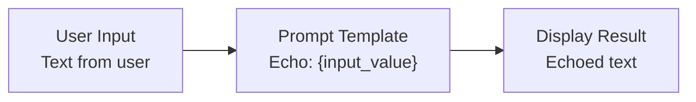

# Tutorial Example 1: Simple Text Echo Flow

## 🎯 What You'll Learn

In this example, you'll learn the fundamental concepts of Langflow:

- **Basic Component Connections** - How to connect input, processing, and output components
- **Data Flow** - Understanding how data moves through a Langflow flow
- **Component Configuration** - How to configure components with custom text
- **Flow Testing** - How to run and test your first Langflow flow

This is the foundation for all more complex flows you'll build later.

## 🏗️ How to Build the Flow

### Step 1: Create New Flow
1. Open Langflow Desktop
2. Click "New Flow" or use Ctrl+N
3. Name it "Simple Text Echo"

### Step 2: Add Components
1. **ChatInput Component**:
   - Drag "ChatInput" from the components panel
   - Position it on the left side
   - No configuration needed

2. **Prompt Template Component**:
   - Drag "Prompt Template" from the Processing section
   - Position it in the center
   - **Configuration**:
     - Set "Template" field to: `Echo: {input_value}`
     - This will prepend "Echo: " to whatever the user types

3. **ChatOutput Component**:
   - Drag "ChatOutput" from the components panel
   - Position it on the right side
   - No configuration needed

### Step 3: Connect Components
1. Click and drag from ChatInput output → Prompt Template input
2. Click and drag from Prompt Template output → ChatOutput input

### Step 4: Flow Diagram

## ⚙️ How to Configure and Run

### Configuration Details

**Prompt Template Component Configuration**:
- **Template Field**: `Echo: {input_value}`
- **Purpose**: This template string will replace `{input_value}` with the actual user input
- **Result**: If user types "Hello", output will be "Echo: Hello"

### Running the Flow

1. **Click the "Run" button** in the top toolbar
2. **Type test input**: "Hello World"
3. **Expected output**: "Echo: Hello World"

### Testing Different Inputs

Try these test cases:
- Input: "Hello" → Output: "Echo: Hello"
- Input: "How are you?" → Output: "Echo: How are you?"
- Input: "123" → Output: "Echo: 123"

## 🎓 Learning Outcomes

After completing this example, you'll understand:

- ✅ **Component Basics** - How to add and position components
- ✅ **Data Flow** - How data flows from input → processing → output
- ✅ **Text Templates** - How to use `{input_value}` placeholders
- ✅ **Flow Execution** - How to run and test flows
- ✅ **Component Connections** - How to wire components together

## 🔧 Troubleshooting

### Common Issues

**"No output displayed"**:
- Check that all components are properly connected
- Verify the Prompt Template component has the correct template: `Echo: {input_value}`

**"Template not working"**:
- Ensure you're using `{input_value}` exactly as shown
- Check that the Prompt Template component is connected to ChatInput

**"Flow won't run"**:
- Make sure all components are connected in a chain
- Verify there are no broken connections (red lines)

## 🚀 Next Steps

Once you've successfully built and tested this flow:

1. **Save your flow** as `Tutorial_Example_1.flow`
2. **Try modifying the template** - change "Echo:" to something else
3. **Add more text processing** - try multiple Text components
4. **Move to Example 2** - Basic LLM Flow

## 📁 Files Created

- **Flow File**: `Tutorial_Example_1.flow` (export from Langflow)
- **Documentation**: This file (`Tutorial_Example_1.md`)

---

**Congratulations!** You've built your first Langflow flow! 🎉
