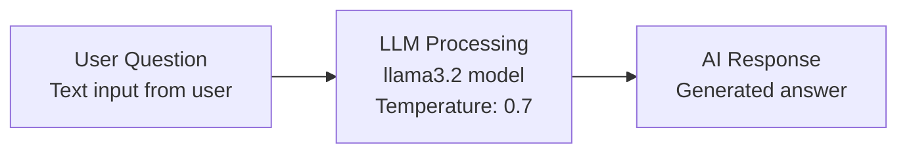

# Tutorial Example 2: Basic LLM Flow

## 🎯 What You'll Learn

In this example, you'll learn to integrate language models with Langflow:

- **LLM Integration** - How to connect and configure language models
- **Ollama Setup** - How to use local language models
- **Model Configuration** - Temperature, model selection, and parameters
- **AI Responses** - How to get intelligent responses from AI models

This builds on Example 1 by replacing simple text processing with AI-powered responses.

## 🏗️ How to Build the Flow

### Prerequisites
Before starting, ensure Ollama is installed and running:
```bash
# Install Ollama (if not already installed)
# Visit https://ollama.ai/ and follow instructions

# Start Ollama service
ollama serve

# Pull a model (in another terminal)
ollama pull llama3.2
```

### Step 1: Create New Flow
1. Open Langflow Desktop
2. Click "New Flow" or use Ctrl+N
3. Name it "Basic LLM Flow"

### Step 2: Add Components
1. **ChatInput Component**:
   - Drag "ChatInput" from the components panel
   - Position it on the left side
   - No configuration needed

2. **OllamaModel Component**:
   - Drag "OllamaModel" from the components panel
   - Position it in the center
   - **Configuration**:
     - **Model**: `llama3.2`
     - **Base URL**: `http://localhost:11434`
     - **Temperature**: `0.7`
     - **Max Tokens**: `512`

3. **ChatOutput Component**:
   - Drag "ChatOutput" from the components panel
   - Position it on the right side
   - No configuration needed

### Step 3: Connect Components
1. Click and drag from ChatInput output → OllamaModel input
2. Click and drag from OllamaModel output → ChatOutput input

### Step 4: Flow Diagram



## ⚙️ How to Configure and Run

### Configuration Details

**OllamaModel Component Configuration**:
- **Model**: `llama3.2` (or any model you have installed)
- **Base URL**: `http://localhost:11434` (default Ollama port)
- **Temperature**: `0.7` (controls randomness: 0.0 = deterministic, 1.0 = very random)
- **Max Tokens**: `512` (maximum response length)

### Running the Flow

1. **Ensure Ollama is running**:
   ```bash
   ollama serve
   ```

2. **Click the "Run" button** in Langflow

3. **Test with sample questions**:
   - "What is artificial intelligence?"
   - "Explain quantum computing in simple terms"
   - "Write a short poem about coding"

### Expected Behavior

- **Input**: "What is artificial intelligence?"
- **Output**: A detailed, intelligent response from the LLM explaining AI concepts

## 🎓 Learning Outcomes

After completing this example, you'll understand:

- ✅ **LLM Integration** - How to connect language models to flows
- ✅ **Model Configuration** - Temperature, tokens, and other parameters
- ✅ **Local AI** - Using Ollama for local language model inference
- ✅ **AI Responses** - Getting intelligent, contextual responses
- ✅ **Model Selection** - Choosing appropriate models for tasks

## 🔧 Troubleshooting

### Common Issues

**"Connection refused" error**:
- Ensure Ollama is running: `ollama serve`
- Check the Base URL is correct: `http://localhost:11434`

**"Model not found" error**:
- Pull the model: `ollama pull llama3.2`
- Check available models: `ollama list`

**"No response" or slow response**:
- Check if the model is still loading (first run takes time)
- Try a smaller model like `llama3.2:1b` for faster responses

**"Empty response"**:
- Increase Max Tokens to 1024 or higher
- Check the model is fully loaded

### Ollama Commands Reference

```bash
# List installed models
ollama list

# Pull a new model
ollama pull llama3.2

# Run a model directly (for testing)
ollama run llama3.2 "Hello, how are you?"

# Stop Ollama service
pkill ollama
```

## 🚀 Next Steps

Once you've successfully built and tested this flow:

1. **Save your flow** as `Tutorial_Example_2.flow`
2. **Try different models** - experiment with other Ollama models
3. **Adjust parameters** - change temperature and max tokens
4. **Move to Example 3** - Simple MCP Tool Flow

## 📁 Files Created

- **Flow File**: `Tutorial_Example_2.flow` (export from Langflow)
- **Documentation**: This file (`Tutorial_Example_2.md`)

---

**Great job!** You've integrated AI into your Langflow flow! 🤖
