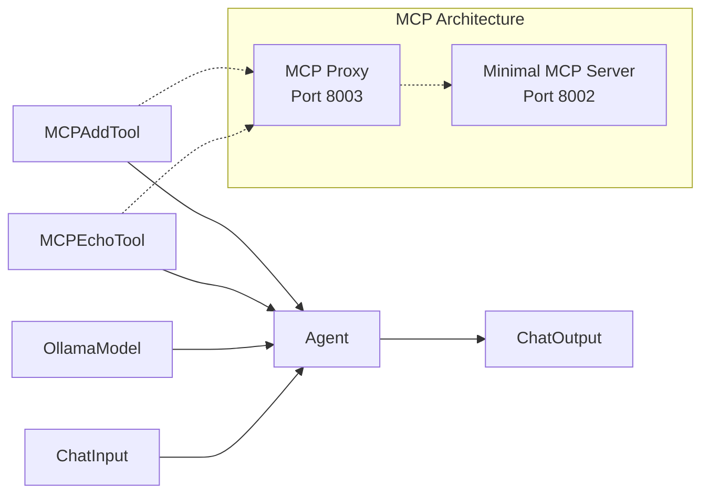

# Tutorial Example 3: MCP Integration with Custom Components

## 🎯 What You'll Learn

In this example, you'll learn to integrate MCP (Model Context Protocol) tools with Langflow using custom components:

- **Custom Components** - How to create Langflow components that call MCP tools
- **MCP Proxy Architecture** - Using a proxy server to bridge Langflow and MCP
- **Tool Integration** - How to make MCP tools available to Langflow flows
- **Agent with Tools** - How LLMs can use MCP tools through custom components
- **HTTP Communication** - Making HTTP requests from custom components

This introduces the powerful concept of giving AI access to external tools and services through custom components.

## 🏗️ How to Build the Flow

### Prerequisites
**Start the MCP servers first!**

```bash
cd /Users/kru031/CSIRO/Projects-CSIRO/CSIRO-2025-ACM_ICMI/LangFlow
source venv/bin/activate
./start_servers.sh
```

### Flow Structure

```
ChatInput → Agent → ChatOutput
           ↑
    MCPEchoTool + MCPAddTool (custom components)
```

### Step-by-Step Instructions

1. **ChatInput Component**:
   - Drag "ChatInput" from the components panel
   - Position it on the left side
   - No configuration needed

2. **MCP Echo Tool Component**:
   - Drag "MCP Echo Tool" from the custom components panel
   - Position it in the center-left
   - **Configuration**:
     - **Text to Echo**: "Hello from MCP!"
     - **Proxy URL**: "http://localhost:8003"

3. **MCP Add Tool Component**:
   - Drag "MCP Add Tool" from the custom components panel
   - Position it below MCP Echo Tool
   - **Configuration**:
     - **First Number**: 5 (integer input)
     - **Second Number**: 3 (integer input)
     - **Proxy URL**: "http://localhost:8003"

4. **OllamaModel Component**:
   - Drag "OllamaModel" from the components panel
   - Position it in the center-left
   - **Configuration**:
     - **Model**: Select your preferred model (e.g., "llama3.2")
     - **Temperature**: 0.7
     - **Max Tokens**: 1000

5. **Agent Component**:
   - Drag "Agent" from the components panel
   - Position it in the center-right
   - **Configuration**:
     - **LLM**: Connect to OllamaModel
     - **Tools**: Connect MCP Echo Tool and MCP Add Tool components
     - **System Message**: "You are a helpful assistant with access to MCP tools. You can use the MCP Echo Tool to echo any text back and the MCP Add Tool to add two numbers together. Choose the appropriate tool based on the user's request."
     - **Note**: The Agent will automatically convert connected components into switchable tools

6. **ChatOutput Component**:
   - Drag "ChatOutput" from the components panel
   - Position it on the right side
   - No configuration needed

### Connections

1. **ChatInput** → **Agent** (message)
2. **OllamaModel** → **Agent** (llm)
3. **MCP Echo Tool** → **Agent** (tools)
4. **MCP Add Tool** → **Agent** (tools)
5. **Agent** → **ChatOutput** (message)

**Note**: The Agent converts components to tools automatically. If you encounter validation errors, the issue is likely that the Agent is passing different data types than expected. The components should work correctly with the Agent's tool conversion system.

### Understanding Agent Tool Conversion

Langflow's Agent automatically converts connected components into tools using LangChain's `StructuredTool` system. The validation error occurs because:

1. **Agent passes data** to components based on the conversation context
2. **Components receive inputs** that may not match the expected types
3. **LangChain validates** inputs before calling the component functions

The components are designed to work with the Agent's tool conversion system.

## 📊 Flow Diagram



## ⚙️ How to Configure and Run

### Configuration Details

**MCPEchoTool Component Configuration**:
- **Text to Echo**: Any text you want to echo back
- **Proxy URL**: `http://localhost:8003` (MCP Proxy server)
- **Note**: This component calls the echo_text tool via the proxy

**MCPAddTool Component Configuration**:
- **First Number**: First number to add
- **Second Number**: Second number to add
- **Proxy URL**: `http://localhost:8003` (MCP Proxy server)
- **Note**: This component calls the add_numbers tool via the proxy

**OllamaModel Component Configuration**:
- **Model**: Your preferred Ollama model (e.g., "llama3.2")
- **Temperature**: 0.7 (controls randomness)
- **Max Tokens**: 1000 (response length limit)

**Agent Component Configuration**:
- **LLM**: Connected to OllamaModel
- **Tools**: Connect both MCPEchoTool and MCPAddTool
- **System Message**: Can be customized for specific behavior
- **Tool Mode**: Enable this switch to convert the connected Data components into tools that the Agent can use

### Running the Flow

1. **Start the MCP servers**:
   ```bash
   ./start_servers.sh
   ```

2. **Verify servers are running**:
   ```bash
   ./check_servers.sh
   ```

3. **Open Langflow Desktop** and create the flow

4. **Test the flow**:
   - Type: "Can you echo 'Hello World' and add 10 + 5?"
   - The Agent will use MCP tools to perform these operations

## 🧪 Expected Output

**Input**: "Can you echo 'Hello World' and add 10 + 5?"

**Expected Response**:
```
I can help you with those operations! Let me use the available MCP tools.

[Agent calls MCP tools]
- Using MCP Echo Tool to echo "Hello World"
- Using MCP Add Tool to calculate 10 + 5

Results:
- 🔧 MCP Echo Tool: Hello World
- 🔧 MCP Add Tool: 10 + 5 = 15

Both operations completed successfully using the MCP tools!
```

**Note**: Each tool output now clearly shows which tool was used with the 🔧 emoji and tool name.

## 🔍 How to See Tool Usage

### 1. **Tool Usage Indicators**
- Look for 🔧 emoji in the output - this indicates a tool was used
- Each tool output shows "MCP [Tool Name] used: [result]"

### 2. **Agent Debug Mode**
- Enable "Verbose" mode in the Agent component
- This shows detailed information about tool selection and usage

### 3. **Console Logs**
- Check the Langflow console for detailed tool call logs
- Shows which tools were called and their parameters

### 4. **Tool Output Visibility**
- Tool outputs are clearly marked with tool names
- Error messages show which tool failed (❌ MCP [Tool Name] error)

## 🔧 Troubleshooting

### Common Issues

1. **"Connection failed" error**:
   - Ensure MCP servers are running: `./check_servers.sh`
   - Check if ports 8002 and 8003 are available: `lsof -i :8002` and `lsof -i :8003`

2. **"No tools available"**:
   - Verify custom components are properly configured
   - Check proxy server logs for errors

3. **"Tool call failed"**:
   - Ensure proxy URL is correct in custom components
   - Check MCP server logs

4. **"ValidationError: Input should be a valid string"**:
   - This occurs when the Agent passes integers to string inputs
   - The components are designed to handle this automatically
   - If the error persists, try restarting Langflow and recreating the flow

5. **"Tools not appearing as switchable"**:
   - Ensure components are connected to the Agent's "Tools" input
   - Check that components have proper descriptions and names
   - Verify the Agent's system message mentions the available tools
   - Try disconnecting and reconnecting the tool components

6. **"Inconsistent response format"**:
   - Some LLM models return JSON format: `{"value": "result"}`
   - Others return clean text: `"result"`
   - This is normal behavior and depends on the model configuration
   - The tools are working correctly regardless of the format

### Debug Steps

1. **Check server status**:
   ```bash
   ./check_servers.sh
   ```

2. **View server logs**:
   ```bash
   tail -f mcp_server_minimal.log
   tail -f mcp_proxy.log
   ```

3. **Test MCP servers directly**:
   ```bash
   curl -X POST http://localhost:8002/mcp/tools/list
   curl http://localhost:8003/tools
   ```

## 📚 Key Concepts Learned

- **Custom Components**: How to create Langflow components that call external services
- **MCP Proxy Architecture**: Using a proxy server to bridge Langflow and MCP
- **HTTP Communication**: Making HTTP requests from custom components
- **Tool Integration**: How to make MCP tools available to Langflow flows
- **Agent Architecture**: Combining LLMs with external capabilities through custom components
- **Server Management**: Starting and monitoring MCP servers

## 🎯 Next Steps

- **Example 4**: Advanced MCP with image annotation
- **Example 5**: MCP with shared resources
- **Example 6**: Custom MCP components

## 📁 Export Flow

Save your completed flow as: `Tutorial_Example_3.flow`

This flow demonstrates the foundation of MCP integration in Langflow!